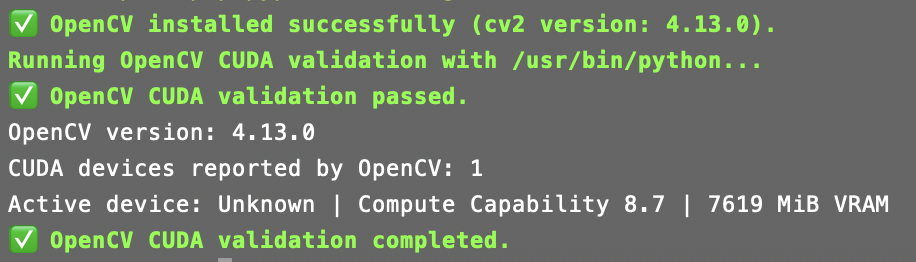

# Summary

NVIDIA Jetson devices (including AGX Orin, Orin Nano, and Thor) are widely used for edge AI and robotics applications. However, converting a freshly flashed Jetson into a working research/development environment is often time-consuming and error-prone due to the tight coupling between JetPack/L4T versions, CUDA-enabled libraries, and Python packages. Manual setup typically involves hours of compilation (particularly for OpenCV with CUDA support) and configuration steps that frequently fail due to dependency conflicts or incomplete documentation.

Jetsonizer is an interactive command-line tool that streamlines *post-flash* setup on Jetson devices by providing a guided terminal workflow built with Gum [@gum] for installing and validating a GPU-accelerated computer-vision and machine-learning toolchain plus common developer utilities. Rather than requiring users to compile OpenCV from source—a process that can take 2-4 hours and often fails—Jetsonizer distributes pre-built, validated CUDA-enabled OpenCV wheels (version 4.13.0 for JetPack 6.2/Python 3.10) that install in minutes with automatic checksum verification.

Jetsonizer emphasizes repeatability and verification: users select tasks via an interactive menu, Jetsonizer executes the corresponding installation steps, and then validates that GPU acceleration is actually functional through automated test scripts. The workflow targets common Jetson stacks such as CUDA-enabled OpenCV [@opencv], PyTorch [@pytorch], and TensorRT [@tensorrt], alongside Python environment tooling (Miniconda [@miniconda] and uv [@uv]) and practical utilities for day-to-day development. The project is open source and intended for lab onboarding and consistent multi-device bring-up.

# Statement of need

Robotics and embedded AI projects frequently require a consistent on-device software stack: camera and sensor pipelines depend on system libraries, while model training and inference depend on compatible versions of CUDA-enabled libraries and Python packages. In practice, Jetson setup involves numerous manual steps that present several challenges:

1. **Lengthy compilation processes**: Building OpenCV from source with CUDA support typically requires 2-4 hours on Jetson hardware and frequently fails due to incomplete dependencies, insufficient swap space, or misconfigured compiler flags.
2. **Dependency conflicts**: TensorRT, PyTorch, and OpenCV each depend on specific CUDA toolkit versions, and manual installation often results in version mismatches that silently disable GPU acceleration.
3. **Environment inconsistencies**: Different team members may use different Python interpreters (system Python, conda environments, venv), leading to installations that work on one device but fail on another.
4. **Unverified GPU access**: Even after seemingly successful installation, libraries may fall back to CPU execution without warning, rendering the GPU-accelerated stack useless for performance-critical robotics applications.

Small differences in setup procedures across devices or team members lead to non-reproducible environments that waste developer time troubleshooting environmental issues rather than focusing on research objectives.

Jetsonizer addresses these challenges by packaging a curated Jetson bring-up workflow behind an interactive terminal UI. It automates installation of a CUDA-enabled ML/vision stack (OpenCV, PyTorch, TensorRT), Python tooling (Miniconda and uv) [@miniconda; @uv], and developer utilities. Critically, Jetsonizer includes comprehensive validation scripts that actively test GPU functionality: the OpenCV validator queries CUDA device properties and reports GPU memory and compute capability, while the PyTorch validator performs tensor operations on the GPU to confirm acceleration is functional. This validation step ensures that the installed stack is not only present but actually capable of GPU-accelerated computation, eliminating a common source of downstream debugging.

# State of the field

NVIDIA SDK Manager provides end-to-end setup for NVIDIA SDKs and is commonly used to flash Jetson devices and install JetPack components [@sdkmanager]. Jetsonizer focuses on the user-facing, post-flash setup steps that teams repeat across devices and lab members, where practical reproducibility issues commonly arise.

For container-first workflows, jetson-containers provides a modular Docker-based system for running AI/ML packages on Jetson [@jetson_containers]. Jetsonizer offers a native-on-host installation path with guided selection and validation, which can be preferable when projects need system-integrated libraries or host-installed dependencies (e.g., OpenCV builds used directly by local applications and drivers).

# Software design and implementation

Jetsonizer is implemented as an interactive CLI that presents a guided menu of setup actions and executes the selected installation and validation steps. The design emphasizes:

1. **Repeatable configuration**: installation steps are scripted and can be re-run consistently across devices.
2. **Explicit verification**: post-install checks validate that key components import correctly and that GPU acceleration is available when expected.
3. **Composable workflows**: steps can be executed individually to match different device states (fresh flash vs. partially configured systems) and project needs.

## Architecture and module organization

Jetsonizer is implemented in Bash to minimize dependencies on freshly-flashed Jetson systems where higher-level scripting languages may not yet be configured. The codebase follows a modular architecture with clear separation of concerns:

- **Device routers** (`router_opencv.sh`, `router_torch.sh`, `router_jtop.sh`): Detect the Jetson model by reading `/proc/device-tree/model` and dispatch to device-specific installation modules for AGX Orin, Orin Nano, or Thor hardware.
- **Device-specific installers** (`agx-orin/`, `thor/`): Contain model-specific installation logic tailored to JetPack versions (e.g., JetPack 6.2 for AGX Orin/Orin Nano, JetPack 7.0 for Thor).
- **Validation scripts** (`tests/`): Python-based GPU capability testers that query CUDA device properties, report compute capability and VRAM, and confirm that libraries can execute GPU operations.
- **Utilities** (`utils/`): Shared infrastructure including Python interpreter detection (supporting conda, venv, uv, pyenv, and system Python), comprehensive logging to `~/.cache/Jetsonizer`, and dependency management.

## Key implementation strategies

**Pre-built wheel distribution**: Rather than requiring source compilation, Jetsonizer distributes pre-built CUDA-enabled OpenCV wheels via GitHub Releases. For JetPack 6.2 (AGX Orin, Orin Nano), the tool downloads a validated OpenCV 4.13.0 wheel (https://github.com/alibustami/Jetsonizer/releases) with SHA-256 checksum verification, reducing installation time from hours to minutes and eliminating common build failures.

**Python environment detection**: Jetsonizer automatically detects the active Python interpreter by checking environment variables (`VIRTUAL_ENV`, `CONDA_PREFIX`, `UV_PROJECT_ENVIRONMENT`, `PYENV_VERSION`) and executable paths. This allows installations to target user-specific environments (conda, venv) or system Python as appropriate, avoiding common issues where packages are installed to the wrong Python installation.

**Comprehensive error handling**: All installation modules use robust error trapping (`set -Eeuo pipefail`) and detailed logging. Failed operations write timestamped logs to `~/.cache/Jetsonizer` with stack traces and diagnostic information, facilitating troubleshooting without cluttering the interactive UI.

**Validation framework**: Post-installation validation is a core design principle. The OpenCV validator imports `cv2`, confirms the presence of `cv2.cuda`, enumerates GPU devices, and reports hardware details (device name, compute capability, VRAM). Similarly, the PyTorch validator confirms `torch.cuda.is_available()` returns `True` and executes a test tensor operation on the GPU. These automated checks provide immediate confirmation that GPU acceleration is functional, preventing silent fallback to CPU execution.

The terminal UI is built using Gum [@gum], a lightweight CLI component library that provides an approachable interactive workflow (category navigation, item selection, progress indicators) while preserving a transparent, scriptable backend for reproducibility and troubleshooting. Installation steps can be selected interactively or driven via scripts for automated lab deployment.

Example screens from the interactive CLI are shown below.

# Research impact

Jetsonizer significantly reduces the time and variability involved in preparing Jetson devices for robotics and embedded AI research:

**Time efficiency**: By distributing pre-built CUDA-enabled OpenCV wheels and automating complex dependency resolution, Jetsonizer reduces typical setup time from 4-6 hours (including compilation and troubleshooting) to 15-30 minutes. This time savings is particularly valuable during lab onboarding, when setting up multiple devices for distributed systems, or when recovering from system failures.

**Reproducibility**: The combination of versioned pre-built wheels, automated validation, and consistent installation workflows ensures that all devices in a lab receive identical software stacks. This eliminates a common source of "works on my machine" issues and allows researchers to focus on scientific questions rather than environment debugging.

**Reliability**: Automated GPU validation provides immediate confirmation that the installed stack is functional. This catches configuration issues (e.g., TensorRT not properly linked, PyTorch falling back to CPU) immediately during setup rather than during critical experiments, improving research reliability.

These benefits are especially impactful in academic and industrial robotics labs where multiple team members work across several Jetson devices and consistent, GPU-accelerated environments are essential for vision and ML workloads.

To support archival and scholarly citation, a versioned release of Jetsonizer is archived on Zenodo (DOI: 10.5281/zenodo.18181257).

# AI usage disclosure

No generative AI tools were used in the development of this software, the writing of this manuscript, or the preparation of supporting materials.

# Acknowledgements

Jetsonizer builds on the open-source ecosystem around the NVIDIA Jetson platform, including Gum for terminal UI components [@gum]. This work received no specific funding.

# References
